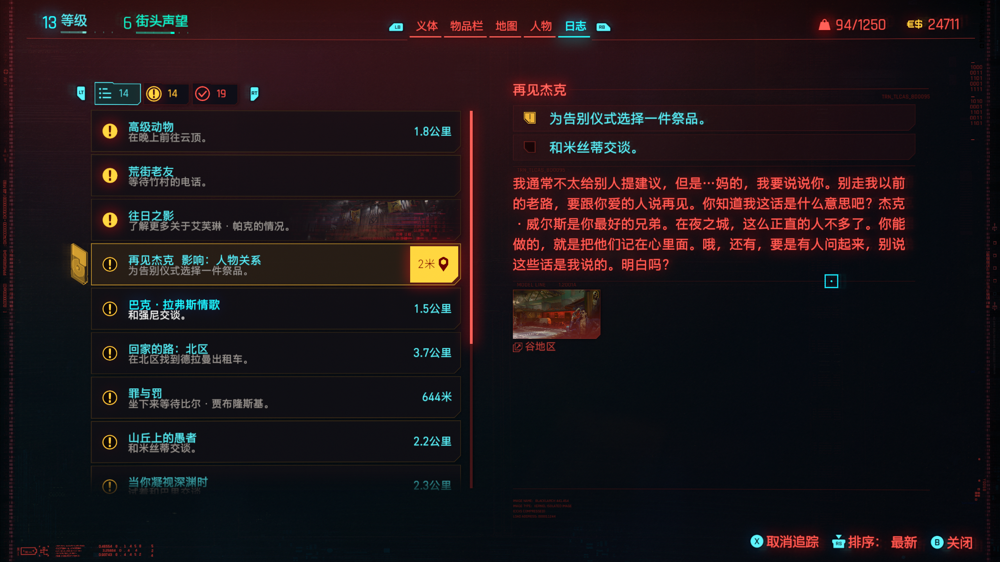
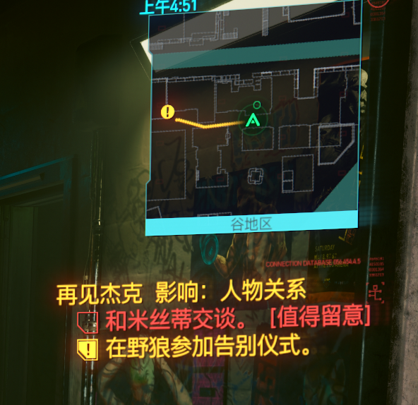

# Cyberpunk 2077 Spoiler-Free Quest Hints

[English](README.md) | [简体中文](README.zh-CN.md)

这是一个轻量级 redscript 模组，会在《赛博朋克 2077》的原生日志与正常游玩任务追踪器中加入**无剧透的任务重要性提示**。

它不会告诉你“应该选什么”，也不会提前揭露“之后会发生什么”，只会在当前任务或目标值得你特别留意时给出提醒。

> **提醒重要性，但不剧透；所有选择都留给玩家自己。**

当前版本：**`v0.1.0-beta.1`**

[下载最新版本](https://github.com/hexu321/cyberpunk2077-spoiler-free-quest-hints/releases/tag/v0.1.0-beta.1)

## 实机截图

### 原生日志中的任务影响提示

任务列表可以直接显示整条任务的无剧透影响摘要，例如人物关系、后续任务、结局条件等，而不告诉玩家具体会发生什么。



### 正常游玩 HUD 中的任务影响与阶段提示

在正常游玩时，任务追踪器也可以同时显示整条任务的影响类型，以及当前 objective 的重要性提示，不需要额外打开攻略窗口。



> 当前截图中的游戏内提示标签为简体中文；规则匹配本身并不依赖任务标题使用中文还是英文。

## 功能特点

- **原生日志集成**：任务影响摘要直接显示在游戏现有的任务列表中。
- **Objective 级别提示**：当前激活目标可以显示 `值得留意`、`重要阶段`、`关键节点 · 建议存档`。
- **正常游玩 HUD 集成**：不打开日志时，也能在任务追踪器中看到对应提示。
- **无剧透设计**：不显示结局名称、人物最终去向、奖励、推荐对话选项或所谓“最佳答案”。
- **稳定 Journal path 匹配**：不依赖本地化后的任务标题文字进行识别。
- **保守规则策略**：证据不足时宁可不提示，也不猜测任务是否会产生长期影响。
- **手柄友好**：不新增必须使用键盘才能完成的操作。

## 提示等级说明

| 等级 | 游戏内显示 | 含义 |
| --- | --- | --- |
| `none` | 不显示 | 普通推进，不额外提醒。 |
| `notice` | `值得留意` | 当前阶段可能存在后续影响。 |
| `important` | `重要阶段` | 建议认真关注当前剧情或目标。 |
| `critical` | `关键节点 · 建议存档` | 有较强证据表明当前阶段存在长期影响，但不会告诉玩家具体后果。 |

整条任务的影响摘要目前可以描述这类宽泛影响：

- `人物关系`：可能影响人物关系；
- `后续任务`：可能影响后续任务；
- `结局条件`：与结局条件存在关联。

这些标签只描述**重要性**，不描述“正确选择”。

## 运行要求

- PC 版《赛博朋克 2077》。
- 当前开发与实机验证基线：Cyberpunk 2077 `2.31 / 2.31a`。
- `redscript` `0.5.31` 或兼容版本，以及你的 redscript 安装本身所需的依赖。

本模组不直接依赖 CET、Codeware、ArchiveXL 或 TweakXL。

## 安装方法

请从 GitHub **Releases** 页面下载真正的模组安装包：

`SpoilerFreeQuestHints-v0.1.0-beta.1.zip`

**不要**把 GitHub 自动生成的 `Source code.zip` 当作模组安装包。

发布包以 Cyberpunk 2077 游戏根目录为起点，结构如下：

```text
r6/
└── scripts/
    └── SpoilerFreeQuestHints/
        ├── GeneratedRules.reds
        ├── HintResolver.reds
        ├── JournalPath.reds
        ├── JournalHintAdapter.reds
        ├── QuestListImpactAdapter.reds
        └── HudQuestTrackerAdapter.reds
```

### 使用 Vortex 安装

1. 从 GitHub Releases 下载 `SpoilerFreeQuestHints-v0.1.0-beta.1.zip`。
2. 在 Vortex 中打开 Cyberpunk 2077。
3. 将下载的 ZIP 添加到 Mods 页面并安装。
4. 如果 Vortex 提示，请启用并部署该模组。
5. 正常启动游戏即可。

不要在交给 Vortex 之前额外套一层文件夹。ZIP 顶层应当直接是 `r6/`。

### 手动安装

1. 下载 `SpoilerFreeQuestHints-v0.1.0-beta.1.zip`。
2. 直接解压到 Cyberpunk 2077 游戏根目录。
3. 确认文件最终位于：

```text
Cyberpunk 2077/r6/scripts/SpoilerFreeQuestHints/
```

4. 正常启动游戏，redscript 会在启动阶段编译这些脚本。

## 卸载方法

删除游戏目录中的以下文件夹：

```text
Cyberpunk 2077/r6/scripts/SpoilerFreeQuestHints/
```

如果通过 Vortex 安装，则在 Vortex 中移除或禁用该模组，并重新部署变更。

本模组不会主动向存档写入专用数据，因此卸载后应当只是移除这些 UI 提示。

## 兼容性

本模组通过包装原生 Journal 与任务追踪控制器来工作，而不是整体替换游戏 UI。

它通常可以与普通 redscript 模组共存；但如果其他 UI overhaul 大量替换或重写了同一组 Journal / Quest Tracker 控制器，则可能发生冲突，需要单独进行兼容性测试。

由于规则使用稳定的 Journal path 匹配，因此并不依赖玩家的任务标题显示为中文还是英文。

## 已知限制

当前仍是 Beta 版本。

- 已验证的剧情规则数据库仍在持续扩充，并非所有重要任务或 objective 都已经覆盖。
- 并非每一条 exact objective 规则都已经在所有可能的存档状态和任务分支下重新验证。
- 当前游戏内提示标签仅提供简体中文，其他语言本地化后续再单独加入。
- 如果其他 UI 模组修改了同一批 Journal 或 HUD 任务追踪控制器，可能需要额外兼容处理。
- 本模组会刻意避免在证据薄弱时猜测，因此某些实际上很重要的节点可能暂时不会显示提示，直到经过验证。

## 无剧透原则

本项目有意**不显示**以下信息：

- 结局名称；
- 谁会死亡或存活；
- 角色最终去向；
- 奖励内容；
- 阵营结果；
- 推荐对话选项；
- 所谓“最佳”或“正确”选择。

UI 只会针对玩家已经到达的剧情内容，显示其重要性等级。

完整规则见 [`docs/spoiler-policy.md`](docs/spoiler-policy.md)。

## 当前开发状态

`v0.1.0-beta.1` 是第一个公开 Beta 版本。

已经在真实游戏环境中验证：

- Journal 左侧任务列表的整条任务影响摘要；
- Journal 右侧 objective 的重要性提示；
- 正常游玩 HUD 中的任务标题影响摘要；
- HUD objective 的重要性提示；
- 稳定 Journal path 匹配；
- 离线规则校验与运行时规则生成。

目前后续工作主要集中在继续扩充并人工复核真实剧情规则数据库。

## 仓库结构

```text
data/
  hints.json                       # 经人工复核的正式规则
  hints.schema.json                # 规则约束
  hints.example.json               # 无剧透示例数据

docs/
  images/                          # README 使用的实机截图
  architecture.md                  # 运行时架构
  spoiler-policy.md                # 无剧透内容规范
  research-notes.md                # 已验证研究记录

research/
  candidates.jsonl                 # 剧情影响候选研究队列
  cases/                           # 单任务调查记录
  sources/                         # 归一化研究来源

tools/
  validate_hints.py                # 正式规则校验
  generate_runtime_rules.py        # JSON -> GeneratedRules.reds
  validate_research_candidates.py  # 研究候选校验
  validate_stage_candidates.py     # 阶段候选校验
  build_release.py                 # 构建可安装 ZIP

src/
  r6/scripts/SpoilerFreeQuestHints/
    GeneratedRules.reds
    HintResolver.reds
    JournalHintAdapter.reds
    QuestListImpactAdapter.reds
    HudQuestTrackerAdapter.reds
    JournalPath.reds
```

## 开发原则

1. 先验证游戏 API，再增加 Hook。
2. 每一条 `critical` 规则都应当有来源和人工复核记录。
3. 正式规则数据中禁止保存推荐选择、结局名称或直接剧透结果。
4. UI 提示只描述玩家已经到达的当前任务 / objective。
5. 不扫描并提前暴露尚未解锁的未来剧情内容。
6. QuestGuide 可以作为 API / 交互研究参考，但不会复制其源码、资产或打包文件。

## 构建发布 ZIP

在仓库根目录运行：

```bash
python tools/build_release.py
```

可安装压缩包会生成到：

```text
dist/SpoilerFreeQuestHints-v0.1.0-beta.1.zip
```

`dist/` 已加入 Git 忽略，不会作为源码提交。
